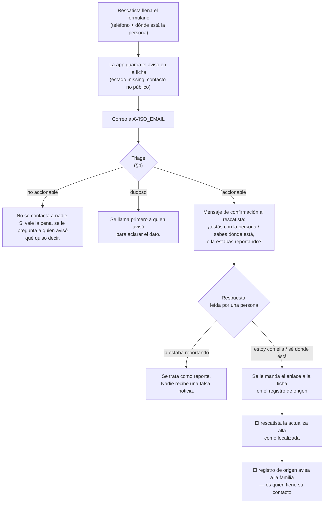

# Qué pasa con un aviso de rescatista

Este documento describe **el camino completo de un aviso**, desde que alguien
llena el formulario hasta que la familia se entera — y, sobre todo, **por qué el
camino tiene los frenos que tiene**.

Está escrito para un mantenedor que abre el buzón hoy y tiene que decidir qué
hacer con lo que llegó. No es teoría: los criterios de abajo se aplican a mano.

> **Estado, a 11 de agosto de 2026.** Los pasos 1 y 2 están vivos. El paso 3 se
> manda **uno por uno, a mano**: no hay envío masivo ni respuesta automática.
> Cada vez que este documento dice "se le escribe", significa *una persona lo
> escribe*.

---

## 1. De dónde sale un aviso

Un rescatista sube la foto de la persona que tiene al lado, el reconocimiento
facial encuentra un reporte, y ahí se abren dos caminos según **qué trae ese
reporte**:

- **Si el reporte trae el contacto de quien la busca**, se le muestra. Fin: el
  rescatista llama y nadie más interviene.
- **Si no lo trae** —típicamente una ficha importada de un registro público— la
  app invierte la pregunta: le pide al rescatista **su teléfono** y **dónde está
  ahora esa persona**, y promete hacerle llegar el aviso a quien la busca. Eso
  es un **aviso de rescatista**.

En el código: el bloque lo arma `matchContactBlock()` y lo recibe
`POST /rescate/aviso`, ambos en `src/routes/web.js`.

Al recibirlo, la app hace dos cosas:

1. **Escribe el aviso en la línea de tiempo de la persona con estado
   `missing`**, a propósito. El estado de una persona es el de su último
   registro: si el aviso entrara como `safe`, un avistamiento sin verificar la
   sacaría de la lista de buscados. El teléfono y el lugar viajan en `contact`,
   que **nunca se renderiza en una página pública** (`publicUpdate()` en
   `src/privacy.js`) — la página pública no puede anunciar dónde encontrar a una
   persona vulnerable.
2. **Manda un correo a `AVISO_EMAIL`.** Es "best effort": si el correo falla, el
   aviso ya está guardado, pero **nadie se entera de que llegó**. Ese buzón es el
   único disparador en tiempo real que tiene el equipo.

Nada más pasa solo. **La app no le escribe a ninguna familia por un aviso.**

---

## 2. Los dos hechos que explican todo lo demás

Si solo se leen dos párrafos de este documento, que sean estos.

### Muchas fichas vienen de un registro externo, y de esas no tenemos el contacto de la familia

Buena parte del catálogo de personas buscadas **no la escribió una familia en
este sitio**: se importó de un registro público de desaparecidos. En esas fichas
el contacto de quien la busca **no existe de nuestro lado** — lo tiene el
registro de origen.

Eso cambia por completo qué significa "avisarle a la familia". No es mandar un
correo: es **hacer que el registro de origen se entere**, porque es el único que
puede alcanzarla.

Un caso real de esta semana, sin datos personales: una persona llegó por
importación y tenía **tres registros distintos en la fuente** — es decir,
probablemente tres parientes distintos buscándola. **Ninguno de esos tres
contactos es accesible desde acá.** Por eso el último paso del flujo no es
burocracia: es la única vía real.

### Marcar a alguien como localizado exige haberlo visto

Uno de los avisos de esta semana decía, literalmente, que había visto a la
persona **en un estado de WhatsApp**. Eso no es un avistamiento: es una
publicación de terceros, de fecha desconocida, reenviada.

Darle a una familia la noticia de que su desaparecido apareció, y que después no
sea cierto, es exactamente el daño que este flujo existe para evitar. Y en un
desastre hay un daño peor detrás del mismo hueco: **el contacto de una familia
angustiada entregado a un desconocido que "dice saber dónde está" es un vector
de extorsión**. Por eso ninguna salida de este flujo es automática, y por eso el
mensaje del último paso dice explícitamente que solo marque a la persona como
localizada **si la vio o habló con ella**.

---

## 3. El flujo

### Paso 1 — Entrada

Ya descrito arriba. El formulario **no rechaza nada**: un rescatista parado al
lado de alguien no puede quedarse peleando con una validación. Una respuesta
imprecisa que se puede repreguntar vale más que un aviso que nunca se mandó.
El costo de esa decisión es que **el triage del paso 2 es obligatorio**.

### Paso 2 — Triage

Los avisos se clasifican **antes de tocar a nadie**. El criterio está en §4.

### Paso 3 — Confirmación con el rescatista

Se le escribe **al rescatista** (nunca a la familia) preguntándole lo único que
desambigua el malentendido más común del formulario:

> ¿Estás con esa persona o sabes dónde ubicarla ahora, o lo que hiciste fue
> reportarla como desaparecida?

Ese mensaje también dice de frente **que nunca pedimos dinero**, y cómo darse de
baja del canal.

Va por WhatsApp, **desde fuera de la app**: el canal de WhatsApp de encontrados.co
está implementado pero dormido (ver `WHATSAPP_TOKEN` en `agent.md`), así que hoy
lo manda un mantenedor desde el número operativo del equipo, uno por uno.

### Paso 4 — La respuesta la lee una persona

Las respuestas caen en un canal que lee un humano. **Nada se contesta solo**, ni
siquiera un acuse de recibo.

Que alguien conteste *"la estaba reportando"* no es un fracaso del flujo: es el
flujo funcionando. Ese aviso se trata como lo que es —un reporte— y ninguna
familia recibió una noticia falsa.

### Paso 5 — Si confirma: la ficha en el registro de origen

Se le manda el enlace a la ficha de esa persona **en el registro público donde su
familia la reportó**, para que **la actualice allá** como localizada. El mensaje
dice, en este orden:

1. Este es el enlace de su ficha en el registro donde su familia la reportó.
2. Ese registro sí le llega a quien la busca: **nosotros no tenemos el contacto
   de su familia, ellos sí**.
3. **Márcala como localizada solo si la viste tú o hablaste con ella.** Si lo que
   viste fue una publicación o te lo contaron, cuéntanos qué viste y lo
   verificamos antes de darle una noticia a su familia.
4. Nunca pedimos dinero.
5. Cómo darse de baja.

El punto 3 no es un detalle de redacción: es el freno del segundo hecho de §2,
escrito donde lo va a leer la única persona que puede activarlo.

---

## 4. El triage, aplicable a mano

**El formulario se malentiende seguido, y ese es el hecho de diseño central.**
No es una intuición: de los **tres primeros avisos** que llegaron, **ninguno era
accionable**.

| Lo que llegó | Por qué no servía |
|---|---|
| Un teléfono de **España** para una dirección en Cali | Quien avisa probablemente no está en el lugar |
| «Yo en Bogotá» en el campo de ubicación | Contestó **dónde estaba quien avisa**, no dónde está la persona buscada |
| Un **nombre propio** en el campo de ubicación | No es un lugar |

Con el criterio afinado y aplicado a los **15 avisos** del día, el reparto quedó:
**8 accionables, 5 a revisar, 2 inalcanzables**.

### Las señales

Se miran dos campos: el **teléfono** y el **"dónde puede ser localizada"**.

**Señales graves** — con una sola, el aviso **no es accionable**:

- **Teléfono con indicativo extranjero.** Quien avisa probablemente no está
  parado al lado de la persona.
- **La ubicación está vacía.**
- **Autorreferencia:** el texto empieza por «yo» o dice dónde está quien avisa
  («yo estoy en…», «yo en Bogotá»).
- **La ubicación es el nombre de la persona buscada**, o tiene toda la pinta de
  un nombre propio: dos o tres palabras, sin números, sin palabra de lugar
  (calle, carrera, barrio, hospital, albergue, coliseo…) y sin ningún topónimo
  reconocible.

**Señales leves** — con una, el aviso queda **dudoso** (se aclara antes de mover
nada):

- **El teléfono no tiene forma de número colombiano** (móvil `3XXXXXXXXX`, fijo
  `60XXXXXXXX`).
- **Eco de la ficha:** la ubicación repite la del reporte original. No aporta
  información nueva sobre dónde está *ahora*.

**Señal a favor:** la ciudad del aviso coincide con la del reporte original.
Corrobora, no autoriza.

### Los tres veredictos, y lo que habilita cada uno

| Veredicto | Cuándo | Qué se hace |
|---|---|---|
| **Accionable** | Ninguna señal | Confirmar con quien avisó (paso 3) y, si confirma, seguir al paso 5 |
| **Dudoso** | Solo señales leves | Llamar primero a quien avisó para aclarar. **No contactar a la familia todavía** |
| **No accionable** | Alguna señal grave | No contactar a nadie con ese dato. Si vale la pena, preguntarle a quien avisó qué quiso decir |

**Ningún veredicto autoriza un contacto automático a una familia.** Lo único que
cambia entre los tres es **la prioridad con la que un humano lo mira**. Esto
importa tanto que conviene decirlo dos veces: el veredicto más limpio posible
sigue terminando en una persona decidiendo.

El criterio es **determinista** a propósito. Su salida gobierna qué se le manda a
una familia, y un umbral que se puede leer, probar y discutir es auditable;
"el modelo dijo que sí" no lo es.

---

## 5. Qué funciona hoy y qué no

| | Estado |
|---|---|
| Formulario de aviso y correo a `AVISO_EMAIL` | **Vivo** |
| El aviso queda en la ficha sin cambiar el estado a «localizada» | **Vivo** |
| Triage de los avisos que llegan | **Vivo**, se corre sobre la cola |
| Mensaje de confirmación al rescatista (paso 3) | **Vivo, pero uno por uno.** Sin envío masivo |
| Lectura de las respuestas | **Humana.** No hay respuesta automática, ni acuse |
| Mensaje con la ficha del registro de origen (paso 5) | **Existe y está aprobado**; se manda a mano, caso por caso |
| Aviso automático a la familia | **No existe, y no está planeado así.** Ver §2 |

---

## 6. Las reglas que no se negocian

1. **Ningún contacto saliente a una familia sin visto bueno de una persona.** Ni
   el veredicto más limpio lo autoriza.
2. **Nunca se marca a alguien como localizado por un aviso sin verificar.** El
   aviso entra a la ficha como `missing`; solo un reencuentro verificado cambia
   un estado.
3. **Nunca se finge que se hizo algo que no se hizo.** Si un aviso no se pudo
   trabajar, el estado lo dice.
4. **El teléfono y el lugar de un aviso no salen a una página pública.** Están en
   `contact`, y `publicUpdate()` es la única puerta por la que una fila de
   `updates` llega a una respuesta pública.
5. **Cero datos personales reales en este repositorio** — ni en un ejemplo, ni en
   un test, ni en un pantallazo de un issue. Los casos de este documento están
   descritos por su **forma**, nunca por quién.

---

## Para el mantenedor que llegó hasta acá

Si tienes un aviso enfrente **ahora mismo**: léelo contra la tabla de señales de
§4, decide el veredicto, y si es accionable manda la pregunta del paso 3. Lo que
**no** puedes hacer, con ningún veredicto, es escribirle a la familia — y en la
mayoría de los casos ni siquiera podrías: su contacto está en el registro de
origen, no acá.
